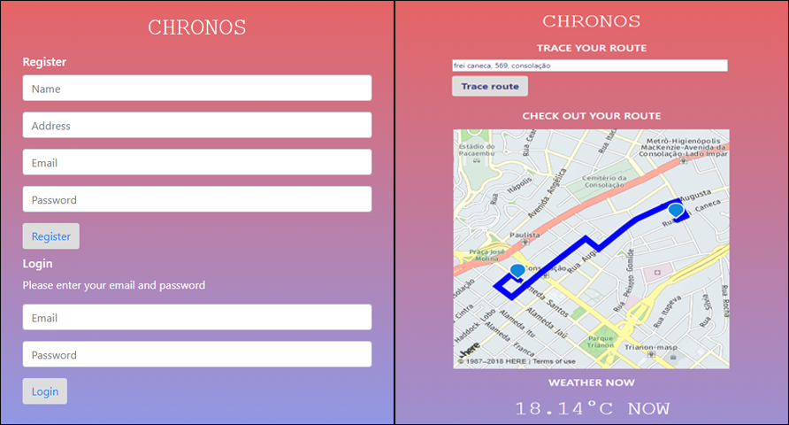

# Chronos

## Motivo

Este é o MVP (mínimo produto viável) do desafio do segundo hackathon do bootcamp Laboratoria.

Em aproximadamente 12 horas de hackaton, trabalhamos em squads de 5 estudantes e deveriamos criar uma aplicação onde o usuário conseguisse traçar rotas para seu destino cadastrado e ver a previsão do tempo no momento de partida. 
O usuário ao se cadastrar coloca o endereço que seria o destino fixo, e assim a partir de qualquer lugar que estiver ele volta ao seu endereço cadastrado.
Para o MVP, limitamos a aplicação para ser usada apenas na cidade de São Paulo.

## Aparência

